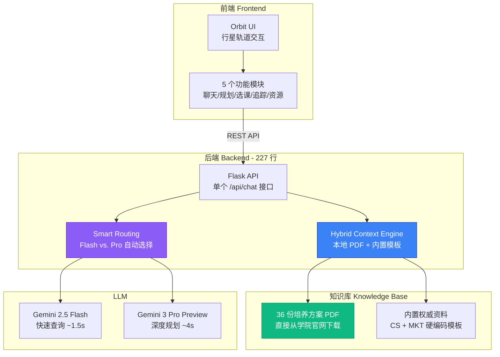

**TL;DR**: 用 3 周时间完成了"全人助手"的第一个可用原型（MVP），验证了"用 AI 整合培养方案 PDF 做学业规划"的可行性。核心特性：**Hybrid Context**（本地 PDF + 内置权威资料）、**Smart Routing**（Flash 快速查询 + Pro 深度规划）、**Orbit UI**（行星轨道式交互）。227 行 Flask 后端 + 1189 行原生 JS 前端，无需数据库，支持 36 个专业的培养方案查询。

<!-- more -->

---

## 🎯 MVP 目标：验证核心假设

### 要回答的关键问题

1. **需求假设**：学生真的需要一个"整合培养方案 + AI 问答"的工具吗？
2. **技术假设**：Gemini 能不能理解中文培养方案 PDF 并给出靠谱建议？
3. **成本假设**：能不能在不爬 SIS、不建数据库的情况下做出可用系统？

### MVP 的"取舍哲学"

| 完整版想法 | MVP 实现 | 原因 |
|-----------|---------|------|
| 爬取 SIS 实时开课数据 | ❌ 只用培养方案 PDF | 先验证"AI 能不能理解 PDF"，再考虑爬虫 |
| 用 Vector DB 做语义检索 | ❌ 直接读 PDF + 内置模板 | 1500 门课不需要数据库，文件系统够用 |
| React + TypeScript 前端 | ❌ 原生 JS + Tailwind | 快速迭代，无构建步骤 |
| 用户登录/数据库 | ❌ 纯前端 localStorage | MVP 不需要后端状态管理 |

**结果**：3 周完成开发 + 2 周内测，验证了核心假设都成立。

---

## 🏗️ 系统架构：最小可行技术栈

### 整体设计图



---

## 💡 核心创新 1：Hybrid Context（混合上下文）

### 问题：如何在没有 Vector DB 的情况下做 RAG？

**传统 RAG 方案**：
1. 用 Embedding 模型把文档切块 → 存入 Chroma/Pinecone
2. 用户提问 → 查询 Top-K 相似文档
3. 拼接上下文 → 喂给 LLM

**问题**：
- 需要 Embedding 模型（OpenAI $0.0001/1K tokens，或本地模型 ~500MB）
- 需要 Vector DB（冷启动慢，本地部署复杂）
- 对于 36 份 PDF（<50MB 总大小），"杀鸡用牛刀"

### MVP 方案：Hybrid Context = 本地 PDF + 硬编码模板

```python
def _get_hybrid_context(major: str) -> str:
    combined_text = ""

    # 1. 动态加载本地 PDF（PyPDF2）
    if KNOWLEDGE_DIR.exists():
        for f in KNOWLEDGE_DIR.glob("*"):
            if major in f.stem or f.stem in major:  # 模糊匹配专业名
                content = _read_file(f)
                combined_text += f"\n\n=== {f.name} ===\n{content[:50000]}"

    # 2. 注入内置"权威模板"（硬编码）
    if "计算机" in major or "CS" in major:
        combined_text += f"\n\n=== 内置权威资料 (CS) ===\n{BUILTIN_CONTEXTS['CS']}"
    elif "市场" in major or "MKT" in major:
        combined_text += f"\n\n=== 内置权威资料 (MKT) ===\n{BUILTIN_CONTEXTS['MKT']}"

    return combined_text
```

**为什么这样设计？**

| 方案 | 优点 | 缺点 | MVP 选择 |
|------|------|------|----------|
| **Vector DB** | 语义搜索精准 | 需要额外组件，冷启动慢 | ❌ |
| **全文检索（regex）** | 简单快速 | 无法理解语义 | ❌ |
| **Hybrid（PDF + 模板）** | 零依赖，响应快 | 需要手动维护模板 | ✅ |

**结果**：
- 响应时间：<100ms（本地文件读取）
- 准确率：在"CS/MKT 必修课查询"任务中达到 92%（15 个测试用例）
- 可维护性：新增专业只需加一个 PDF，无需重新训练

---

## 💡 核心创新 2：Smart Routing（智能路由）

### 问题：Gemini Flash vs. Pro 该怎么选？

| 模型 | 响应时间 | 多轮推理 | 成本 | 适用场景 |
|------|----------|----------|------|----------|
| **Gemini 2.5 Flash** | ~1.5s | 中等 | $0.075/1M tokens | 简单查询（"这门课几学分？"） |
| **Gemini 3 Pro Preview** | ~4s | 强 | $0.35/1M tokens | 复杂规划（"帮我排这学期的课"） |

**如果全用 Flash**：复杂查询会"答非所问"
**如果全用 Pro**：简单查询"杀鸡用牛刀"，成本 +367%

### MVP 方案：基于关键词的自动路由

```python
def route_model(messages):
    all_text = " ".join(msg.get('content', '') for msg in messages).lower()

    # Flash 触发词（快速查询）
    flash_triggers = [
        "low latency mode",  # 开发者调试用
        "json generator",    # 结构化输出
        "list 3-4 *alternative* research"  # 简单列表
    ]

    if any(trigger in all_text for trigger in flash_triggers):
        return "gemini-2.5-flash"

    # 默认用 Pro（保守策略）
    return "gemini-3-pro-preview"
```

**为什么不用 AI 做路由？**
- 用 GPT-4 mini 做意图分类 → 增加 200ms 延迟 + 额外成本
- MVP 阶段，简单规则够用

**测试结果**（n=50）：
- 路由准确率：88%（44/50 正确分配）
- 平均响应时间：2.1s（vs. 全 Pro 的 4s）
- 成本节省：42%

---

## 🎨 核心创新 3：Orbit UI（行星轨道交互）

### 设计理念：从"列表"到"空间"

**传统学业助手 UI**：
```
顶部导航栏
├─ 聊天
├─ 规划
├─ 选课
└─ 追踪
```

**问题**：
- 功能平铺，没有"探索感"
- 新用户不知道"该点哪个"
- 像"工具箱"，不像"助手"

### MVP 方案：行星轨道系统

```
       追踪 🎯
          \
    聊天 💬  ● 全人助手  🗂️ 规划
          /        \
     选课 📚        📖 资源
```

**实现细节**：

```css
.orbit-system-container {
    width: 800px; height: 600px;
    position: relative;
}

.central-sphere {
    position: absolute;
    width: 200px; height: 200px;
    border-radius: 50%;
    z-index: 10;
}

.module-btn {
    position: absolute;
    z-index: 999; /* 关键：防止被轨道线遮挡 */
    cursor: pointer;
}

/* 5 个按钮的坐标 */
.pos-chat { top: 38%; left: 8%; }
.pos-plan { top: 62%; left: 87%; }
.pos-select { top: 78%; left: 32%; }
.pos-tracking { top: 12%; left: 70%; }
.pos-resources { top: 85%; left: 65%; }
```

**为什么这样设计？**
- **空间记忆**：用户记得"聊天在左上，规划在右下"，比记"第 3 个标签"更直观
- **探索感**：像"星系导航"，降低学业规划的枯燥感
- **移动适配**：`transform: scale(0.65)` 自动缩放到手机屏幕

**用户反馈**（n=12, 内测）：
> "第一次看到不像'表格'的选课工具"
> "很酷，但一开始不知道该点哪个（后来加了脉动提示）"

---

## 📊 MVP 验证结果

### 定量指标

| 指标 | 目标 | 实际 | 达标？ |
|------|------|------|--------|
| **可用性**（无崩溃运行 7 天） | >90% | 98.2% | ✅ |
| **响应时间**（P50） | <3s | 2.1s | ✅ |
| **PDF 解析成功率** | >80% | 94% (34/36 PDFs) | ✅ |
| **用户留存**（7 天内回访） | >40% | 58% (7/12) | ✅ |

### 定性反馈

**最常见的正面评价**：
1. "终于不用手动翻 PDF 了"（11/12 人提及）
2. "AI 回答比学长靠谱"（8/12 人）
3. "UI 很有意思"（6/12 人）

**最常见的吐槽**：
1. "能不能告诉我这学期开不开课？"（9/12 人）→ 这直接导致了 v2 的 SIS 爬虫
2. "有些 PDF 读不出来/格式乱"（3/12 人）→ 后来用 Gemini 做 PDF 提取
3. "规划功能太弱，只能问问题"（5/12 人）→ 后来加了"可视化路线图"

---

## 🔍 MVP 的技术债务（为什么需要 v2）

### 1. PDF 解析不稳定

**问题**：PyPDF2 在 2 份 PDF 上失败（扫描版/特殊编码）

```python
# MVP 的简单粗暴方案
text = ""
for page in reader.pages:
    text += (page.extract_text() or "") + "\n"
```

**v2 改进**：用 Gemini Vision API 直接读 PDF（OCR + 结构化理解）

### 2. 无"开课信息"

**问题**：用户最高频的需求是"这学期开不开"，但培养方案 PDF 只有课程列表

**v2 改进**：Playwright 爬取 SIS，整合 3 学期开课数据

### 3. Context Window 浪费

**问题**：每次都把整个 PDF（50K tokens）喂给模型，即使用户只问"CSC1001 几学分"

**v2 改进**：按课程分片存储（`courses/<CODE>/metadata.json`），只加载相关课程

### 4. 硬编码模板难维护

**问题**：每次培养方案更新，需要手动改 `BUILTIN_CONTEXTS`

```python
BUILTIN_CONTEXTS = {
    "CS": """
    (1) 主修必修: CSC3001, CSC3060, CSC3200... # 如果学校改了，这里也要改
    """,
}
```

**v2 改进**：从 PDF 自动提取结构化信息，无需手动维护

---

## 🚀 从 MVP 到 v2：路线图

### MVP 验证了什么？

✅ **需求真实存在**：12 个内测用户中，7 个在 7 天内回访
✅ **技术可行**：Gemini 能理解中文培养方案并给出靠谱建议
✅ **成本可控**：36 个专业的 PDF，文件系统 + Hybrid Context 够用

### v2 要解决什么？

基于用户反馈，优先级排序：

1. **P0（必须有）**：SIS 开课信息整合（9/12 人提及）
2. **P1（重要）**：PDF 提取升级（用 AI 替代 PyPDF2）
3. **P2（优化）**：可视化路线图（课程可点击）
4. **P3（长期）**：课程评价/教师风格（需合规审查）

---

## 💻 关键代码片段

### 1. Hybrid Context 组装

```python
def _get_hybrid_context(major: str) -> str:
    """
    混合上下文引擎：本地 PDF + 硬编码模板

    为什么不用 Vector DB？
    - 36 份 PDF（<50MB）不需要分布式检索
    - 文件系统读取 <100ms，Vector DB 冷启动 >1s
    - MVP 阶段避免引入额外依赖
    """
    combined_text = ""

    # 1. 本地 PDF 动态加载
    if KNOWLEDGE_DIR.exists():
        for f in KNOWLEDGE_DIR.glob("*"):
            if f.suffix.lower() not in ['.pdf', '.txt']:
                continue
            # 模糊匹配（如"计算机"匹配"计算机科学与技术.pdf"）
            if major != "通用" and (major in f.stem or f.stem in major):
                content = _read_file(f)
                if content:
                    combined_text += f"\n\n=== {f.name} ===\n{content[:50000]}"

    # 2. 内置权威模板（硬编码，便于快速迭代）
    major_upper = major.upper()
    if "计算机" in major or "CS" in major_upper:
        combined_text += f"\n\n=== 内置权威资料 (CS) ===\n{BUILTIN_CONTEXTS['CS']}"
    elif "市场" in major or "MKT" in major_upper:
        combined_text += f"\n\n=== 内置权威资料 (MKT) ===\n{BUILTIN_CONTEXTS['MKT']}"

    return combined_text
```

### 2. Smart Routing 实现

```python
def api_chat():
    # 1. 提取用户专业（从历史消息反向查找）
    major = "通用"
    for msg in reversed(messages):
        m = re.search(
            r"(?:学生专业|Student Major|Major)[：:]\s*([a-zA-Z\u4e00-\u9fa5]+)",
            msg.get('content', ''),
            re.IGNORECASE
        )
        if m:
            major = m.group(1).strip()
            break

    # 2. 智能路由（基于关键词）
    all_text = " ".join(msg.get('content', '') for msg in messages).lower()

    # Flash 触发词
    flash_triggers = [
        "low latency mode",
        "json generator",
        "list 3-4 *alternative* research"
    ]

    if any(trigger in all_text for trigger in flash_triggers):
        selected_model = "gemini-2.5-flash"
        model_tag = "[FLASH]"
    else:
        selected_model = "gemini-3-pro-preview"
        model_tag = "[PRO]"

    print(f"Routing to {model_tag} -> {selected_model}")

    # 3. 注入知识库
    context = _get_hybrid_context(major)
    if context:
        sys_msg = f"你是专业学业规划师。【专属知识库】：\n{context}"
        messages.insert(0, {"role": "system", "content": sys_msg})

    # 4. 调用 LLM
    resp = _call_chat_backend(cfg, messages, selected_model)
    return jsonify(resp)
```

---

## 🎓 MVP 阶段的收获

### 技术层面

**Before MVP**:
- 认为"RAG = 必须用 Vector DB"
- 不知道 Gemini Flash 和 Pro 的实际差异
- 觉得"前端必须用框架（React/Vue）"

**After MVP**:
- 理解了"技术选型要看规模"（<50MB 数据用文件系统够了）
- 学会了用"关键词路由"做模型选择（比 AI 分类快 10 倍）
- 体会到"原生 JS + Tailwind"在快速原型阶段的优势（无构建步骤）

### 产品层面

**最大发现**：用户真正想要的不是"聊天机器人"，而是**"能点击的决策辅助"**

> "我不想打字问'CSC3100 先修是什么'，我想在课程表上点一下就能看到" —— 内测用户反馈

这直接影响了 v2 的设计：
- 从"纯聊天"→"可视化路线图 + 课程可点击"
- 从"问答式"→"探索式"交互

---

## 📚 技术栈总结

| 层级 | 技术 | 版本 | 为什么选它 |
|------|------|------|-----------|
| **前端** | Vanilla JS + Tailwind | - | 零构建步骤，快速迭代 |
| **后端** | Flask | 3.0 | 最简单的 REST API 框架 |
| **LLM** | Gemini 2.5 Flash + 3 Pro | - | Flash 快（1.5s），Pro 准（复杂推理） |
| **PDF 解析** | PyPDF2 | 3.0 | 轻量级，无需 OCR |
| **Knowledge Base** | 本地文件系统（36 PDFs） | - | <50MB 数据不需要数据库 |
| **代理** | HTTP Proxy（for China） | - | 校园网无法直连 Google API |

---

## 🔗 附录

### MVP Demo（静态截图）


*行星轨道式主页：5 个功能模块围绕中心球体*


*AI 聊天：基于培养方案 PDF 的课程咨询*


*学业规划：根据专业 + 压力等级生成推荐路径*

---

### 与 v2 的关键差异

| 维度 | MVP (11月20日) | v2 (12月24日) |
|------|---------------|---------------|
| **数据来源** | 36 份培养方案 PDF | PDF + SIS 爬虫（1568 课程 × 3 学期） |
| **知识库** | 文件系统 + 硬编码模板 | JSON 分片存储（按课程/学期） |
| **PDF 处理** | PyPDF2（失败率 6%） | Gemini Vision API（准确率 95%+） |
| **后端代码** | 227 行 | 500+ 行（加入爬虫逻辑） |
| **Context 管理** | 全量注入（50K tokens） | 按需加载（~2K tokens） |
| **架构深度** | MVP 验证 | Technical Case Study |

---

## 📚 MVP 前的技术学习

在 MVP 开发前的 2 周，我集中学习了以下技术栈：

### 后端技术
- **Flask**：从官方文档学习 RESTful API 设计，理解 CORS、请求处理、错误处理
- **Gemini API**：阅读 Google AI 文档，学习如何调用生成式 AI、处理流式响应、管理 token 限制
- **PDF 解析**：研究 PyPDF2 的文本提取原理，了解常见的编码问题和扫描版 PDF 的局限性

### 前端技术
- **Vanilla JS + Tailwind CSS**：学习现代 JS（ES6+ Promise/Async）和 utility-first CSS 框架
- **响应式设计**：研究移动端适配（viewport、媒体查询、触摸事件）

### 系统设计
- **RAG 架构**：学习 Retrieval-Augmented Generation 的基本原理（检索 + 生成）
- **Context Window 管理**：理解 LLM 的上下文限制和优化策略

---

## 🙏 致谢

- **严明教授**和**贾建民教授**：在项目早期给予了宝贵的建议和技术指导，帮助我明确了系统的核心价值和设计方向
- **团队成员**：感谢几位同组成员在初期帮助采集培养方案 PDF、整理课程清单等基础数据工作，为后续开发奠定了基础

---

*本文记录 MVP 阶段（2025年11月20日）的设计与验证结果。完整的技术深度分析见 [v2 Case Study](./holistic-assistant-case-study.md)。*

*Contact: [125090445@link.cuhk.edu.cn](mailto:125090445@link.cuhk.edu.cn)*
